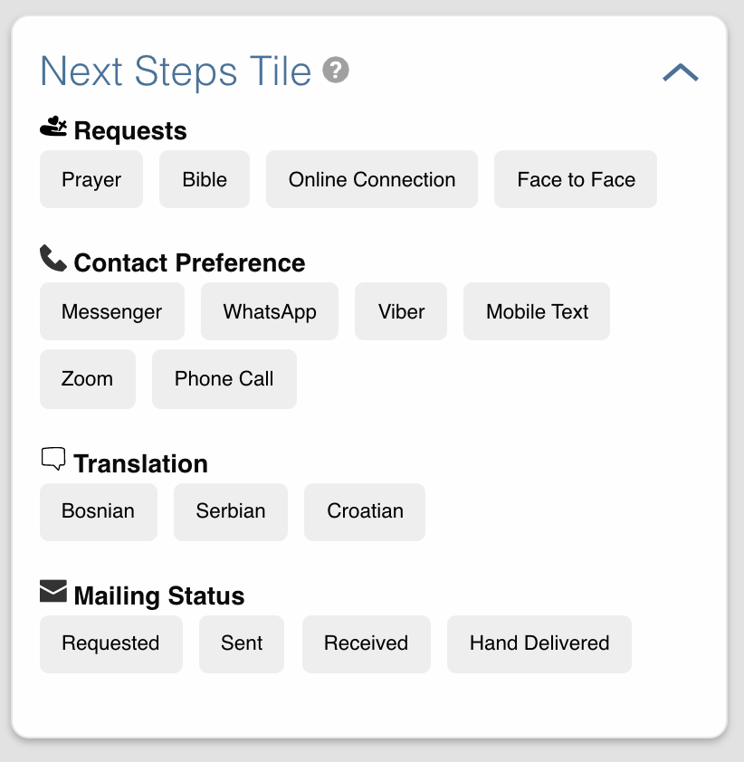

# Disciple Tools - Next Steps Tile Plugin (BETA)

## Purpose

This plugin adds the Next Steps Tile to a project by default and avoids manual configuration.

## Usage

#### Will Do

- Will add Next Steps tile to Contacts module

## Requirements

- Disciple Tools Theme installed on a Wordpress Server

## Installing

- Install as a standard Disciple.Tools/Wordpress plugin in the system Admin/Plugins area
- Activate plugin
- Requires the user role of Administrator.

## Contribution

Contributions welcome. You can report issues and bugs in the
[Issues](https://github.com/prykon/next-steps-tile/issues) section of the repo. You can present ideas
in the [Discussions](https://github.com/prykon/next-steps-tile/discussions) section of the repo. And
code contributions are welcome using the [Pull Request](https://github.com/prykon/next-steps-tile/pulls)
system for git. For a more details on contribution see the
[contribution guidelines](https://github.com/prykon/next-steps-tile/blob/master/CONTRIBUTING.md).

## Screenshots

